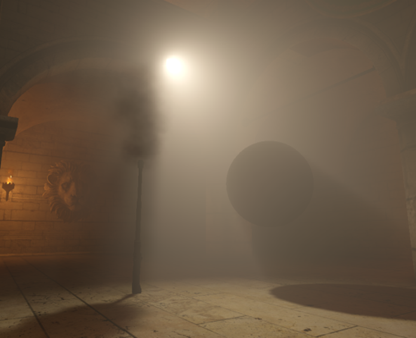
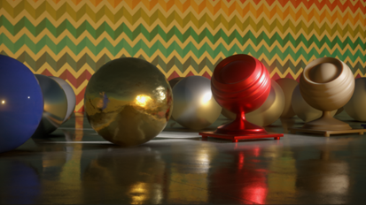
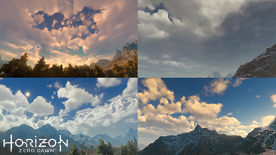
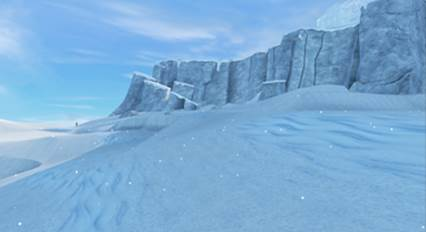
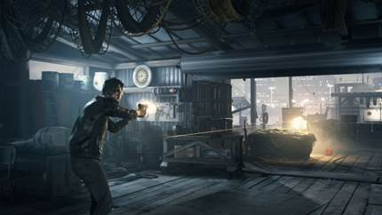

# [SIGGRAPH] Advances in Real-Time Rendering in Games course

- Link: https://advances.realtimerendering.com/

#### 2015

| Title                                                        | Preview                                                      | Description                             |
| ------------------------------------------------------------ | ------------------------------------------------------------ | --------------------------------------- |
| Towards Unified and Physically-Based Volumetric Lighting in Frostbite |  |                                         |
| Stochastic Screen-Space Reflections                          |  |                                         |
| The Real-time Volumetric Cloudscapes of Horizon: Zero Dawn   |                   | 基于3D Noise的体积云Model和Lighting方案 |
| A Novel Sampling Algorithm for Fast and Stable Real-Time Volume Rendering |  |                                         |
| Sparkly but not too Sparkly! A Stable and Robust Procedural Sparkle Effect |  |                                         |
| Multi-Scale Global Illumination in Quantum Break             |  |                                         |
|                                                              |                                                              |                                         |

